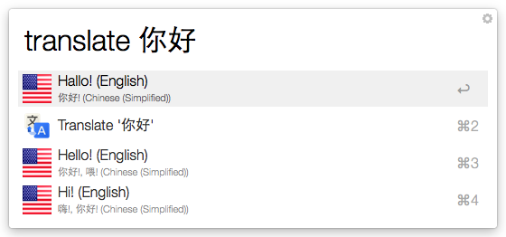
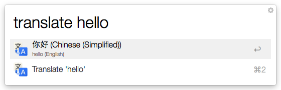
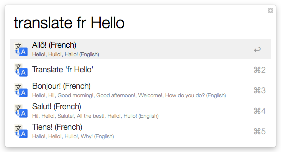
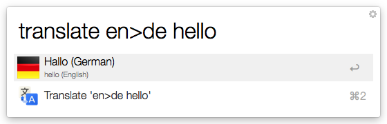

Google Translate Alfred Workflow
=============================

Forked from the version 2.2.2 of Thomas's [workflowv](https://github.com/thomashempel/AlfredGoogleTranslateWorkflow).

## License

The MIT License (MIT)

Copyright (c) 2013-2014 Thomas Hempel <thomas@scriptme.de> & Zeyue Chen <zeyuec@gmail.com>.

## How to use

* Not using a language selector: 

	If you don't use a language selector, it will automatically detect the phrase you input and translate them between English and Chinese.
	
		translate hello 			// will translate "hello" from English to Chinese
		tranlate "你好"				// will translate "你好" from Chinese to English

* Using a Language Selector:

		translate de>en Haus		// Will translate "Haus" from german to english.
	    translate de>fr Auto		// Will translate "Auto" from german to french
	    translate fr<en bottle		// Will translate "bottle" from english to french  
    
## Languages

* auto = Automatic
* af = Afrikaans
* sq = Albanian
* ar = Arabic
* hy = Armenian
* az = Azerbaijani
* eu = Basque
* be = Belarusian
* bn = Bengali
* bg = Bulgarian
* ca = Catalan
* zh-CN = Chinese (Simplified)
* zh-TW = Chinese (Traditional)
* hr = Croatian
* cs = Czech
* da = Danish
* nl = Dutch
* en = English
* eo = Esperanto
* et = Estonian
* tl = Filipino
* fi = Finnish
* fr = French
* gl = Galician
* ka = Georgian
* de = German
* el = Greek
* gu = Gujarati
* ht = Haitian Creole
* iw = Hebrew
* hi = Hindi
* hu = Hungarian
* is = Icelandic
* id = Indonesian
* ga = Irish
* it = Italian
* ja = Japanese
* kn = Kannada
* km = Khmer
* ko = Korean
* lo = Lao
* la = Latin
* lv = Latvian
* lt = Lithuanian
* mk = Macedonian
* ms = Malay
* mt = Maltese
* no = Norwegian
* fa = Persian
* pl = Polish
* pt = Portuguese
* ro = Romanian
* ru = Russian
* sr = Serbian
* sk = Slovak
* sl = Slovenian
* es = Spanish
* sw = Swahili
* sv = Swedish
* ta = Tamil
* te = Telugu
* th = Thai
* tr = Turkish
* uk = Ukrainian
* ur = Urdu
* vi = Vietnamese
* cy = Welsh
* yi = Yiddish

## Screenshots

## The end

Thanks for using this workflow!
Feel free to fork and/or make suggestions.

Best wishes, 

Thomas & Zeyue